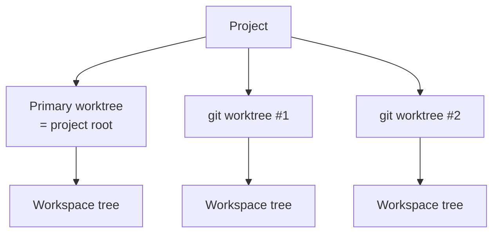

# Worktrees

Every project starts with a primary worktree (the project root). Git projects can attach more — each worktree has its own tabs, splits, and active selection.



## Worktree picker

Click the worktree button in the topbar (or `⌘⇧O`) to:

- See all known worktrees and their branches.
- Create a new git worktree.
- Refresh the list (picks up worktrees created externally with `git worktree add`).

## Creating a worktree

The **New Worktree** sheet asks for:

| Field | Notes |
| --- | --- |
| Branch | Existing branch, or a new branch name |
| Base | Ref to branch from (when creating a new branch) |
| Path | Where the worktree directory should live |

Muxy runs `git worktree add` and registers the new worktree with the project.

## Setup commands

If `.muxy/worktree.json` exists, its setup commands run automatically when a tab is created in a freshly added worktree. Use it to bootstrap dependencies (`npm install`, `bundle install`, …) for ephemeral worktrees.

## Persistence

Per-project worktree records live at `~/Library/Application Support/Muxy/worktrees/<projectID>.json`. Removing a project also removes its worktree records. Externally discovered worktrees are never touched by Muxy's cleanup paths — only the user's repo can unregister them.

## Notes

- Switching worktrees does **not** kill running terminals — they stay alive; you just see a different worktree's tabs.
- The primary worktree (project root) is always present and cannot be deleted from Muxy.

## Smarty Code agent tree

In the wide sidebar, Smarty Code can render a read-only agent tree under each worktree when the hidden agent-tree feature flag is enabled. The tree is loaded from a local registry file and groups conductor, orchestrator, and subagent sessions by their declared worktree/cwd. Compact sidebar mode remains unchanged.

Default registry path:

```text
/tmp/smarty-code-agent-usage-milestone/agent-sessions.json
```

Enable the hidden tree and optionally override the registry with:

```bash
defaults write com.smartypants.smarty-code smarty.agentTree.enabled -bool true
# or for one launch:
SMARTY_CODE_AGENT_TREE_ENABLED=1

SMARTY_CODE_AGENT_SESSION_REGISTRY=/path/to/agent-sessions.json
```

Registry schema:

```json
{
  "generated_at": "2026-05-10T12:00:00Z",
  "sessions": [
    {
      "id": "worker-a",
      "parent_id": "orchestrator-1",
      "role": "subagent",
      "title": "Agent tree hardening",
      "status": "running",
      "proof_status": "tool_active",
      "risk_flags": ["dirty_worktree"],
      "cwd": "/repo-track-a",
      "worktree_path": "/repo-track-a",
      "branch": "feature/agent-tree",
      "tmux_session": "muxy-agent-tree-a",
      "codex_log": "logs/worker-a.jsonl",
      "final_report": "FINAL_REPORT.md"
    }
  ]
}
```

Allowed values:

| Field | Values |
| --- | --- |
| `role` | `architect`, `conductor`, `orchestrator`, `subagent`, `unknown` |
| `status` | `ready`, `running`, `blocked`, `complete`, `failed`, `stale`, `unknown` |
| `proof_status` | `unverified`, `prompt_delivered`, `tool_active`, `final_reported`, `validated` |
| `risk_flags` | `shared_worktree`, `dirty_worktree`, `missing_log`, `stale_log`, `unverified_prompt_receipt`, `unvalidated_final_report`, `stale_child`, `unknown` |

The registry is observational: Smarty Code reads session metadata, Codex log paths, proof status, and risk flags, but it does not launch, stop, broadcast to, or mutate tmux/Codex sessions. Rows with children are expandable/collapsible. Open actions are limited to existing local worktree directories and log/report files; invalid or missing paths are not opened. Attach, send prompt, broadcast, mark blocked, mark complete, and stop controls remain visible but disabled until a later guarded control phase.
